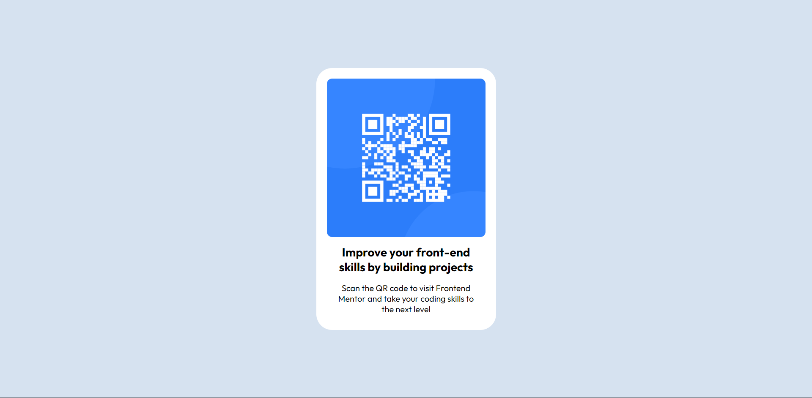

# fm-qr-code-component-main

Esta es una solución al [desafío del componente de código QR en Frontend Mentor](https://www.frontendmentor.io/challenges/qr-code-component-iux_sIO_H). Los desafíos de Frontend Mentor lo ayudan a mejorar sus habilidades de codificación mediante la creación de proyectos realistas.

- Solution URL: [Github](https://github.com/ayrtonbolwal/fm-qr-code-component-main)
- Live Site URL: [Netifly](https://ayrtonbolwal-qr-component-challenge.netlify.app/)

## Mi Proceso

- Semántica de HTML5
- Variables en CSS
- Técnicas de Flexbox
- Convención BEM

## Cosas que aprendí

- El manejo y dimensionamiento de bordes
- Convención BEM

## Recursos

- [Conveción BEM](https://www.freecodecamp.org/espanol/news/convenciones-de-nomenclatura-de-css-que-te-ahorraran-horas-de-depuracion/)

## Autor

- Twitter: [@ayrtonbolwal](https://twitter.com/ayrtonbolwal)
- Github: [@ayrtonbolwal](https://github.com/ayrtonbolwal)
- Email: ayrtonbolwal@gmail.com

Happy Coding! 👾🖖
